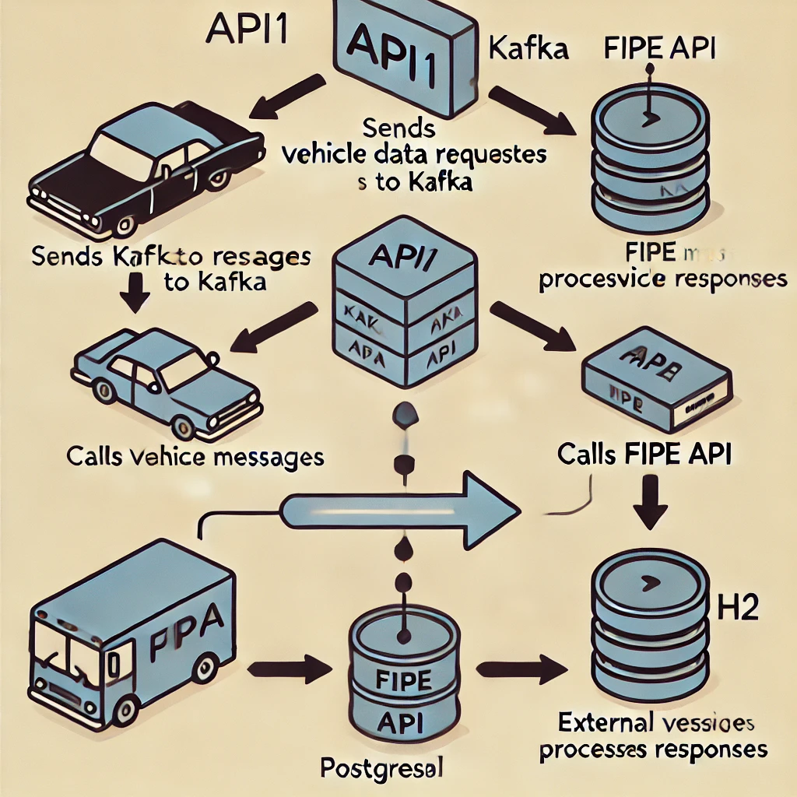

# FipeApi - Проект Java Backend с Quarkus, Maven, Docker, PostgreSQL, Kafka, H2, Hibernate, JUnit, Panache, Lombok, Jackson и Mappers


Этот проект представляет собой бэкенд, разработанный на **Java** с использованием фреймворка **Quarkus**, с интеграцией **Kafka** для асинхронной связи, **PostgreSQL** для хранения данных, **H2** для тестов в памяти и **FIPE API** для получения информации о транспортных средствах. Также используется **Lombok** для сокращения кода и **Jackson** для сериализации/десериализации JSON. **Mappers** используются для преобразования данных между DTO и сущностями.

### Структура проекта

- **API1**: Отправляет запросы в очередь Kafka с данными о транспортных средствах.
- **API2**: Потребляет сообщения из очереди Kafka, выполняет вызовы к сервису FIPE и обрабатывает ответы.
- **Kafka**: Очереди сообщений для асинхронной связи между API1 и API2.
- **PostgreSQL**: База данных, используемая для хранения информации о транспортных средствах и результатах запросов к FIPE.
- **H2**: Встроенная база данных для тестов.
- **Quarkus**: Фреймворк для создания RESTful API с акцентом на производительность и быструю разработку.
- **Hibernate (Panache)**: ORM (Object-Relational Mapping) для упрощения отображения между объектами Java и таблицами базы данных.
- **Lombok**: Библиотека, уменьшающая количество boilerplate кода (например, геттеры, сеттеры и конструкторы).
- **Jackson**: Библиотека для работы с JSON, используемая для сериализации и десериализации данных.
- **JUnit**: Фреймворк для юнит-тестирования.
- **Mappers**: Преобразование данных между DTO и сущностями, реализуемое вручную или с использованием таких библиотек, как MapStruct.

### Используемые технологии

- **Quarkus**: Современный Java-фреймворк, оптимизированный для быстрого создания микросервисов и RESTful API.
- **Maven**: Менеджер зависимостей и инструмент для сборки.
- **Docker**: Используется для контейнеризации проекта, упрощая его запуск в различных средах.
- **PostgreSQL**: Реляционная база данных для хранения данных о транспортных средствах и запросах к API FIPE.
- **Kafka**: Система обмена сообщениями для асинхронной связи между API.
- **FIPE API**: Внешний сервис, предоставляющий информацию о транспортных средствах в Бразилии, такую как марка, модель и цена.
- **H2**: База данных в памяти для проведения юнит-тестов и интеграционных тестов.
- **Hibernate (Panache)**: ORM, используемый для взаимодействия с базой данных, упрощая сохранение и извлечение данных.
- **Lombok**: Библиотека, автоматически генерирующая код, такой как геттеры, сеттеры, конструкторы и другие, уменьшая количество повторяющегося кода.
- **Jackson**: Библиотека для сериализации и десериализации объектов Java в JSON и наоборот.
- **JUnit**: Фреймворк для юнит-тестирования и интеграционных тестов.
- **MapStruct**: Библиотека (опционально) для маппинга между объектами DTO и сущностями, обеспечивающая эффективные преобразования без написания кода вручную.

### Как запустить проект

#### 1. Предварительные требования

- **Docker**: Убедитесь, что у вас установлен [Docker](https://www.docker.com/get-started).
- **Java 17+**: Quarkus оптимизирован для Java 17 и выше. Если у вас нет JDK 17 или выше, скачайте [здесь](https://adoptopenjdk.net/).
- **Maven**: Используется для управления зависимостями и сборки. Если у вас его нет, следуйте инструкциям по установке [здесь](https://maven.apache.org/install.html).

#### 2. Клонировать репозиторий

```bash
git clone https://github.com/locomontero/fipeapi
cd fipeapi


### Inglês

```
# FipeApi - Java Backend Project with Quarkus, Maven, Docker, PostgreSQL, Kafka, H2, Hibernate, JUnit, Panache, Lombok, Jackson, and Mappers

This project is a backend developed in **Java** using the **Quarkus** framework, integrated with **Kafka** for asynchronous communication, **PostgreSQL** for data persistence, **H2** for in-memory testing, and the **FIPE API** for querying vehicle information. It also uses **Lombok** to reduce boilerplate code and **Jackson** for JSON serialization/deserialization. **Mappers** are used to convert data between DTOs and Entities.

### Project Structure

- **API1**: Responsible for sending requests to the Kafka queue with vehicle data.
- **API2**: Consumes messages from the Kafka queue, calls the FIPE service, and processes the responses.
- **Kafka**: Message queues for asynchronous communication between API1 and API2.
- **PostgreSQL**: Database used to store vehicle information and FIPE query results.
- **H2**: In-memory database used for testing.
- **Quarkus**: Framework for creating RESTful APIs with a focus on performance and rapid development.
- **Hibernate (Panache)**: ORM (Object-Relational Mapping) to simplify mapping between Java objects and database tables.
- **Lombok**: Library to reduce boilerplate code (such as getters, setters, and constructors).
- **Jackson**: Library for JSON manipulation, used for serialization and deserialization of data.
- **JUnit**: Framework for unit testing.
- **Mappers**: Conversion of data between DTOs and entities, implemented manually or with the help of libraries like MapStruct.

### Technologies Used

- **Quarkus**: A modern Java framework optimized for fast development of microservices and RESTful APIs.
- **Maven**: Dependency manager and build tool.
- **Docker**: Used to containerize the project, simplifying execution in different environments.
- **PostgreSQL**: Relational database used to store vehicle data and FIPE API query information.
- **Kafka**: Messaging system used for asynchronous communication between the APIs.
- **FIPE API**: External service providing vehicle information in Brazil, such as brand, model, and price.
- **H2**: In-memory database used for unit and integration tests.
- **Hibernate (Panache)**: ORM used for database interaction, simplifying data persistence and retrieval.
- **Lombok**: Library that automatically generates code such as getters, setters, constructors, and others, reducing repetitive code.
- **Jackson**: Library for serializing and deserializing Java objects to JSON and vice versa.
- **JUnit**: Framework for unit and integration testing.
- **MapStruct**: Library (optional) for mapping between DTO objects and entities, providing efficient mappings without writing manual code.

### How to Run the Project

#### 1. Prerequisites

- **Docker**: Make sure you have [Docker](https://www.docker.com/get-started) installed.
- **Java 17+**: Quarkus is optimized for Java 17 or higher. If you don’t have JDK 17 or higher, download it [here](https://adoptopenjdk.net/).
- **Maven**: Used for dependency management and building. If you don’t have it, follow the installation instructions [here](https://maven.apache.org/install.html).

#### 2. Clone the Repository

```bash
git clone https://github.com/locomontero/fipeapi
cd fipeapi
